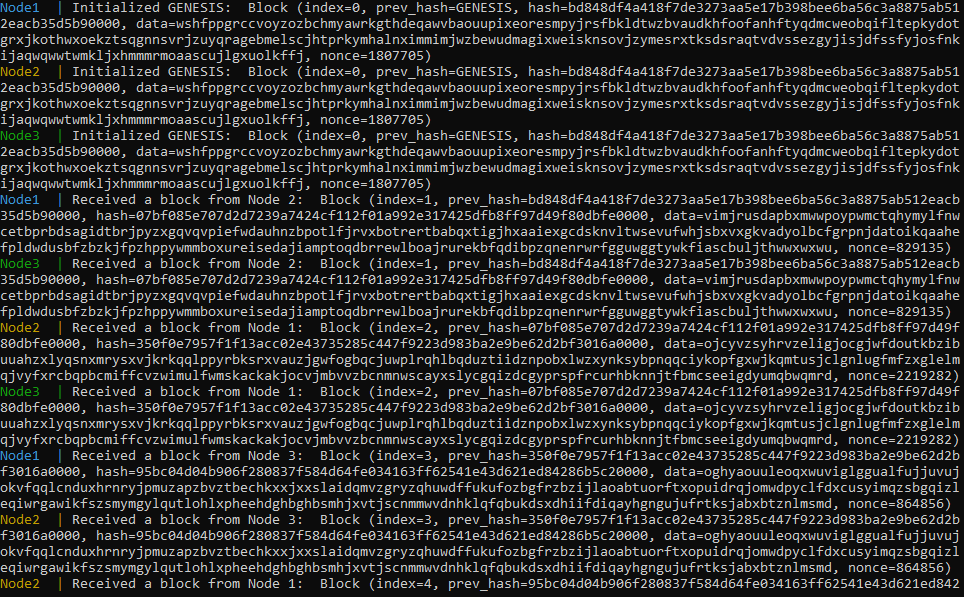

# PolytechnicBlockchain

| main                                                                                                             | develop                                                                                                                |
|------------------------------------------------------------------------------------------------------------------|------------------------------------------------------------------------------------------------------------------------|
|  |  |

## Description

Python Blockchain using Flask

## About
- `block` — a class for generating blocks of the blockchain:
  - `index` - block number. The numbers increase in order, starting with the first.
  - `prev_hash` - hash of the previous block.
  - `hash` - hash of the current block. It will need to be calculated.
  - `data` - string of 256 random characters.
  - `nonce` - this is an addition to calculate hash.
- `node` — a class for storing, generating and handling blocks.
- `server` — a class that handles interaction between nodes.

## Getting started
First, clone this repository:

```
git clone https://github.com/iTteruya/polychain.git
```
And go to the project folder:

```
cd polychain
```

Then, build Docker image:

```
docker build -t tr/polychain:latest .
```
Lastly, launch Docker Compose:

```
docker-compose up
```

### Demonstration
After launching Docker Compose, you should see something similar to this:



At the start, the GENESIS block is generated and distributed to all nodes. Once received, a race ensues among the nodes to compute the hash of the subsequent block that ends in 4 zeros and broadcast this information to the network.